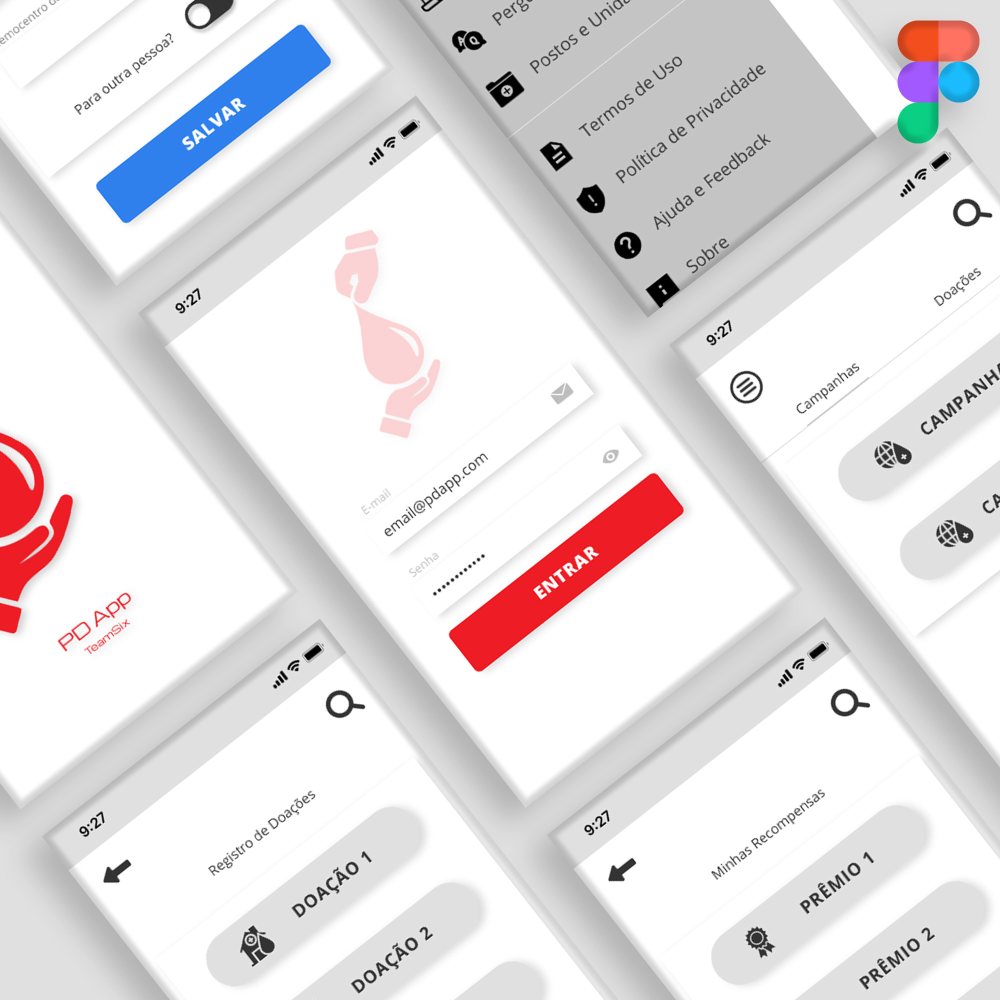

# pdapp

O PdApp é um projeto feito pela equipe da faculdade FICR ( PE ).
 

 

Aplicativo tem a responsabilidade em contribuir com a disseminação da doação de sangue através de campanhas independentes.
Além disso, o usuário tem acesso á informações pertinentes sobre o ato de doação e a busca por vários hemocentros,
núcleos e pontos de coletas espalhados por todo o país.

#Como testar o app.

- Você pode clonar o projeto e testar localmente no seu pc.
- Ou você pode acessar o link: https://fircteamsix.github.io/pdapp/
